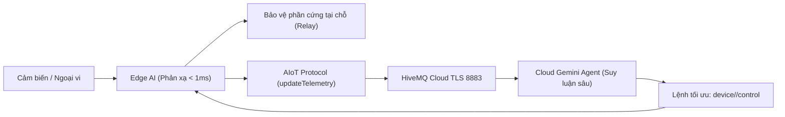

# 🚀 AIoT Library (AIoT_Lib)

<p align="center">
  <b>Framework AIoT & IoT Mã Nguồn Mở Hiệu Năng Cao Cho Các Dòng Vi Điều Khiển ESP32 & Đa Nền Tảng Cloud / AI</b>
</p>

<p align="center">
  
  
  
  
  
  
</p>

---

## 📑 Mục lục (Table of Contents)

1. [Giới thiệu tổng quan](#-1-giới-thiệu-tổng-quan-overview)
2. [Kiến trúc hệ thống 5 Phân hệ](#-2-kiến-trúc-hệ-thống-5-phân-hệ-modular-architecture)
3. [Chi tiết các Module chuyên sâu](#-3-chi-tiết-các-module-chuyên-sâu)
   - [3.1. AIoT Core (IoT & Truyền thông)](#31-aiot-core-iot--truyền-thông)
   - [3.2. AI_Math (Học thuật & Điện toán AI)](#32-ai_math-học-thuật--điện-toán-ai)
   - [3.3. Device (Trừu tượng hóa phần cứng HAL)](#33-device-trừu-tượng-hóa-phần-cứng-hal)
   - [3.4. EdgeAI (Trí tuệ nhân tạo tại biên)](#34-edgeai-trí-tuệ-nhân-tạo-tại-biên)
   - [3.5. CloudAI & HybridAI (Trí tuệ nhân tạo đám mây & AI đa tầng)](#35-cloudai--hybridai-trí-tuệ-nhân-tạo-đám-mây--ai-đa-tầng)
4. [Hỗ trợ phần cứng & Giao thức](#-4-hỗ-trợ-phần-cứng--giao-thức)
5. [Hướng dẫn cài đặt](#-5-hướng-dẫn-cài-đặt-installation)
6. [Các bài ví dụ mẫu (Examples)](#-6-các-bài-ví-dụ-mẫu-examples)
7. [Các cờ tiền xử lý (Pre-processor Flags)](#-7-các-cờ-tiền-xử-lý-pre-processor-flags)
8. [Tác giả & Bản quyền](#-8-tác-giả--bản-quyền-author--license)

---

## 📖 1. Giới thiệu tổng quan (Overview)

**AIoT_Lib** là một framework mã nguồn mở tiên tiến được thiết kế chuyên biệt cho việc xây dựng các nút mạng **AIoT (Artificial Intelligence of Things)** và **IoT công nghiệp**. 

Thư viện tích hợp liền mạch từ tầng phần cứng (HAL), tầng truyền thông bảo mật **MQTT TLS/SSL (Port 8883)**, giao diện Web cấu hình thông minh **Captive Portal**, đến các thuật toán **Điện toán & Học thuật AI (AI_Math)**, bộ máy suy luận **Edge AI (TinyML)** tại thiết bị và kết nối trực tiếp với các mô hình **Cloud LLM (Google Gemini, OpenAI)** theo mô hình **Hybrid AI**.



---

## 🏛️ 2. Kiến trúc hệ thống 5 Phân hệ (Modular Architecture)

Thư viện được cấu trúc thành **5 phân hệ hoàn toàn độc lập**, cho phép lập trình viên và nhà nghiên cứu tùy biến, bật/tắt hoặc mở rộng theo nhu cầu:

```text
AIoT_LIB/
├── src/
│   ├── AIoT.h                         # Header tổng (bao gồm IoT Core & Modbus)
│   ├── AIoT.hpp                       # Khởi tạo instance
│   │
│   ├── AI_Math/                       # 🧮 1. HỌC THUẬT & ĐIỆN TOÁN TOÁN HỌC AI
│   │   ├── AI_Math.h                  # Header chính AI_Math
│   │   ├── Matrix.hpp                 # Ma trận, Vector, Tích vô hướng, Dense Layer
│   │   ├── Statistics.hpp             # Thống kê (Mean, Variance, StdDev, RMS, MinMax, Z-Score)
│   │   ├── DSP.hpp                    # Xử lý tín hiệu (Sliding Window, IIR Filter, FFT)
│   │   ├── Activations.hpp            # Hàm kích hoạt (ReLU, LeakyReLU, Sigmoid, Softmax)
│   │   └── OnlineLearning.hpp         # Thuật toán tự học trực tuyến (Welford, Online k-NN, K-Means)
│   │
│   ├── Device/                        # 🔌 2. TRỪU TƯỢNG HÓA PHẦN CỨNG (HAL)
│   │   ├── Device.h                   # Header chính Device (AIoT_Device)
│   │   ├── Device.hpp                 # Lớp quản lý AIoTDeviceManager
│   │   ├── Actuator.hpp               # Quản lý Relay, PWM, LED, Buzzer
│   │   ├── Sensor.hpp                 # Quản lý cảm biến Analog, Digital, Chip Temp, RAM
│   │   └── Profiles/                  # Sơ đồ chân định nghĩa sẵn theo từng board
│   │       ├── Board_Default_ESP32.h  # ESP32 DevKit Standard
│   │       ├── Board_ESP32_S3_Kit.h   # ESP32-S3 AIoT DevKit
│   │       ├── Board_ESP32_CAM.h      # ESP32-CAM AI Vision
│   │       └── Board_AIoT_Industrial.h# AIoT Industrial Controller (RS485 + Opto Relay)
│   │
│   ├── EdgeAI/                        # ⚡ 3. TRÍ TUỆ NHÂN TẠO TẠI BIÊN (TINYML)
│   │   ├── EdgeAI.h                   # Header chính EdgeAI
│   │   ├── EdgeAI.hpp                 # Lớp quản lý quy trình suy luận EdgeAI::Engine
│   │   ├── AnomalyDetector.hpp        # Phát hiện bất thường tự căn chỉnh (Auto-baseline)
│   │   ├── Classifier.hpp             # Bộ phân loại trạng thái thiết bị đa lớp
│   │   └── Models/                    # Lưu trữ các mô hình mẫu (C-Array Models)
│   │       └── MotorVibrationModel.h  # Model mẫu phân loại rung động động cơ
│   │
│   ├── CloudAI/                       # ☁️ 4. CLOUD AI & GENERATIVE AI AGENTS
│   │   ├── CloudAI.h                  # Header chính CloudAI
│   │   ├── PromptTemplates.hpp        # Tự động sinh Prompt JSON chuẩn hóa cho Gemini
│   │   ├── AgentProtocol.hpp          # Chuẩn hóa giao thức giao tiếp 2 chiều với AI Agent
│   │   └── GeminiClient.hpp           # Client hỗ trợ gọi trực tiếp REST API của Gemini
│   │
│   ├── HybridAI/                      # 🔄 5. NHẠC TRƯỞNG HYBRID AI (BIÊN + ĐÁM MÂY)
│   │   ├── HybridAI.h                 # Header chính HybridAI
│   │   └── HybridAI.hpp               # Điều phối phản xạ tức thì + Đồng bộ insight lên Cloud
│   │
│   ├── IoT/                           # 📡 Giao thức AIoT (Protocol, API, Param, Handler)
│   ├── MQTT/                          # 🔐 Kết nối HiveMQ Cloud TLS 8883
│   ├── WiFi/                          # 🌐 Quản lý WiFi, Captive Portal WebUI
│   └── Ultility/                      # ⚙️ Modbus RTU/RS485, cJSON, Timer Scheduler
```

---

## 🔍 3. Chi tiết các Module chuyên sâu

### 3.1. AIoT Core (IoT & Truyền thông)
- **Chuẩn hóa Topic MQTT**:
  - `device/<MAC_ADDRESS>/telemetry`: Đẩy dữ liệu cảm biến định kỳ lên Cloud.
  - `device/<MAC_ADDRESS>/control`: Nhận lệnh điều khiển từ Web/App/AI Agent và phản hồi xác nhận trạng thái.
- **Bảo mật**: Kết nối mã hóa TLS/SSL (Port 8883), tích hợp chứng chỉ an toàn.
- **Smart Captive Portal (Web PnP)**: Khi mất kết nối hoặc đổi mạng, thiết bị tự động phát Access Point (`AIoT: <MAC>`, IP: `192.168.21.6`) với giao diện Web hiện đại để quét WiFi và cấu hình MQTT.
- **Lập trình hướng sự kiện**: Macro `Virtual_WRITE(relay1)` tự động bắt sự kiện điều khiển từ JSON mà không cần viết hàm parse thủ công.

### 3.2. AI_Math (Học thuật & Điện toán AI)
Dành cho lập trình viên và nhà nghiên cứu muốn tự xây dựng hoặc huấn luyện mô hình AI ngay trên chip:
- **`Statistics`**: Tính Mean, Variance, StdDev, RMS, Peak-to-Peak, MinMax, Z-Score.
- **`Matrix`**: Tích vô hướng, khoảng cách Euclid/Manhattan, lớp Dense Layer forward.
- **`DSP`**: Cửa sổ trượt `SlidingWindow`, bộ lọc trung bình trượt `MovingAverageFilter`, bộ lọc `LowPassFilter`, và biến đổi Fourier nhanh **`FastFourierTransform` (FFT)** để phân tích phổ tần số âm thanh/rung động.
- **`Activations`**: Hàm kích hoạt mạng nơ-ron (ReLU, LeakyReLU, Sigmoid, Tanh, Softmax, ArgMax).
- **`OnlineLearning`**: 
  - *Thuật toán Welford $O(1)$*: Học phân phối chuẩn trực tuyến không tốn bộ nhớ.
  - *Online k-NN*: Phân loại mẫu trực tiếp trên chip.
  - *Online K-Means*: Phân cụm tự động không cần gán nhãn trước.

### 3.3. Device (Trừu tượng hóa phần cứng HAL)
Cung cấp giao diện `AIoT_Device` độc lập với phần cứng:
- Chọn loại board chỉ bằng 1 dòng cờ: `#define BOARD_ESP32_S3_KIT` hoặc `#define BOARD_AIOT_INDUSTRIAL`.
- Điều khiển ngữ nghĩa: `AIoT_Device.relay(1, HIGH)`, `AIoT_Device.beep(100)`, `AIoT_Device.readVoltage(1)`.

### 3.4. EdgeAI (Trí tuệ nhân tạo tại biên)
- **Phát hiện bất thường (Anomaly Detection)**: Tự học đường cơ sở (Baseline) khi khởi động, tính điểm bất thường $[0.0, 1.0]$.
- **Phân loại trạng thái (Classifier)**: Đưa ra cảnh báo `NORMAL`, `WARNING`, `CRITICAL` trong $< 1\text{ms}$.
- **Hỗ trợ nạp mô hình TinyML**: Tương thích mô hình C-Array trích xuất từ Edge Impulse hoặc TensorFlow Lite Micro.

### 3.5. CloudAI & HybridAI (Trí tuệ nhân tạo đám mây & AI đa tầng)
- **Tích hợp Gemini 1.5 Flash**: Tự động sinh Prompt JSON chuẩn hóa cho các tác vụ chuẩn đoán lỗi, giám sát thông minh và thị giác máy tính.
- **Hybrid AI Orchestration**: Phản xạ ngắt relay khẩn cấp tại biên ngay khi có sự cố mà không cần chờ Internet, đồng thời trích xuất đặc trưng gửi lên cho Gemini Agent phân tích xu hướng dài hạn.

---

## 💻 4. Hỗ trợ phần cứng & Giao thức

### 🔹 Vi điều khiển (Hardware Support)
- **ESP32** (Dual-Core, Solo-1, WROOM, WROVER)
- **ESP32-S2 / ESP32-S3** (Hỗ trợ Vector Extensions, Camera, USB OTG)
- **ESP32-C3 / ESP32-C6** (Kiến trúc RISC-V, WiFi 6 & BLE 5)

### 🔹 Giao thức truyền thông
- **WiFi 802.11 b/g/n & SoftAP** (Bộ nhớ NVS lưu đa điểm mạng).
- **MQTT qua TLS/SSL (Port 8883)**.
- **Modbus RTU / RS485** (UART công nghiệp).

---

## 📦 5. Hướng dẫn cài đặt (Installation)

### Dành cho PlatformIO
Thêm thư viện vào dự án trong file `platformio.ini`:

```ini
[env:esp32-s3]
platform = espressif32
board = esp32-s3-devkitc-1
framework = arduino
monitor_speed = 115200
lib_deps = 
    https://github.com/ThangNguyen2106-dash/AIoT_DEVERLOPMENT.git
```

### Dành cho Arduino IDE
1. Tải repository dưới dạng file `.zip`: [AIoT_DEVERLOPMENT.zip](https://github.com/ThangNguyen2106-dash/AIoT_DEVERLOPMENT/archive/refs/heads/main.zip).
2. Trong Arduino IDE, chọn **Sketch** $\rightarrow$ **Include Library** $\rightarrow$ **Add .ZIP Library...** và chọn file vừa tải.

---

## 📖 6. Các bài ví dụ mẫu (Examples)

### 📌 Ví dụ 1: Cơ bản về IoT & Đồng bộ dữ liệu lên Cloud
> 📂 Thư mục: [`examples/01_Basic_IoT/01_Basic_IoT.ino`](examples/01_Basic_IoT/01_Basic_IoT.ino)

```cpp
#include <Arduino.h>
#include <AIoT.h>

const char *WIFI_SSID = "YOUR_WIFI_SSID";
const char *WIFI_PASS = "YOUR_WIFI_PASSWORD";
const char *MQTT_USER = "IoT_TEST";
const char *MQTT_PASS = "mt21062005";

#define RELAY_PIN 2

// Bắt lệnh điều khiển từ Cloud: {"data": {"relay1": 1}}
Virtual_WRITE(relay1)
{
    int state = param.getInt();
    digitalWrite(RELAY_PIN, state ? HIGH : LOW);
    AIoT.writeControl("relay1", state); // Xác nhận phản hồi
}

void sendSensorData()
{
    if (!AIoT.CheckConnect()) return;

    // Gom dữ liệu và gửi 1 gói tin JSON duy nhất
    AIoT.updateTelemetry("chip_temp", temperatureRead());
    AIoT.updateTelemetry("free_ram", (int)ESP.getFreeHeap());
    AIoT.updateTelemetry("wifi_rssi", WiFi.RSSI());
    AIoT.sendTelemetry();
}

void setup()
{
    Serial.begin(115200);
    pinMode(RELAY_PIN, OUTPUT);
    AIoT.begin(WIFI_SSID, WIFI_PASS, MQTT_USER, MQTT_PASS);
    AIoT.addTimeEvent(3000, sendSensorData);
}

void loop()
{
    AIoT.run();
}
```

---

### 📌 Ví dụ 2: Học thuật & Điện toán AI (`AI_Math`)
> 📂 Thư mục: [`examples/02_AI_Math_Academic/02_AI_Math_Academic.ino`](examples/02_AI_Math_Academic/02_AI_Math_Academic.ino)

```cpp
#include <Arduino.h>
#include <AI_Math/AI_Math.h>

void setup()
{
    Serial.begin(115200);

    // 1. Thuật toán Welford học phân phối chuẩn trực tuyến O(1) bộ nhớ
    AI_Math::WelfordEstimator welford;
    welford.update(10.5);
    welford.update(11.2);
    welford.update(10.8);
    Serial.printf("Mean: %.2f | StdDev: %.2f\n", welford.getMean(), welford.getStdDev());

    // 2. Thuật toán k-NN tự học và phân loại mẫu trên chip
    AI_Math::OnlineKNN<2, 10, 3> knn;
    float normal[] = {1.0, 25.0};
    float fault[] = {8.5, 75.0};
    knn.addSample(normal, 0); // Lớp 0: Bình thường
    knn.addSample(fault, 1);  // Lớp 1: Sự cố

    float query[] = {8.7, 78.0};
    int predicted = knn.predict(query);
    Serial.printf("Predicted Class: %d (0: Normal, 1: Fault)\n", predicted);
}

void loop() {}
```

---

### 📌 Ví dụ 3: Phát hiện bất thường bằng Edge AI (Anomaly Detection)
> 📂 Thư mục: [`examples/03_Edge_AI_Anomaly/03_Edge_AI_Anomaly.ino`](examples/03_Edge_AI_Anomaly/03_Edge_AI_Anomaly.ino)

```cpp
#include <Arduino.h>
#define BOARD_ESP32_S3_KIT
#include <Device/Device.h>
#include <EdgeAI/EdgeAI.h>

EdgeAI::Engine edgeAI;

void setup()
{
    Serial.begin(115200);
    AIoT_Device.begin();
    edgeAI.begin(3.0f, 30); // Tự học 30 mẫu baseline ban đầu
}

void loop()
{
    float sensorSample = AIoT_Device.readVoltage(1) * 10.0f;
    EdgeAI::InferenceResult res = edgeAI.process(sensorSample);

    // Phản xạ tức thì tại chỗ (< 1ms) không cần Internet
    if (res.isEmergency) {
        AIoT_Device.relay(1, LOW); // Cắt tải bảo vệ máy
        AIoT_Device.beep(100);
    }

    delay(100);
}
```

---

### 📌 Ví dụ 4: Toàn diện Hybrid AIoT (Edge AI + HiveMQ Cloud + Gemini Agent)
> 📂 Thư mục: [`examples/05_Hybrid_AI_Industrial/05_Hybrid_AI_Industrial.ino`](examples/05_Hybrid_AI_Industrial/05_Hybrid_AI_Industrial.ino)

```cpp
#include <Arduino.h>
#define BOARD_AIOT_INDUSTRIAL
#include <AIoT.h>
#include <HybridAI/HybridAI.h>

HybridAIEngine hybridAI;

// Nhận lệnh điều khiển từ Gemini Agent trên Cloud
Virtual_WRITE(relay1)
{
    int state = param.getInt();
    AIoT_Device.relay(1, state ? HIGH : LOW);
    AIoT.writeControl("relay1", state);
}

void setup()
{
    Serial.begin(115200);
    AIoT_Device.begin();
    hybridAI.begin(3.0f, 50);
    AIoT.begin("YOUR_SSID", "YOUR_PASS", "IoT_TEST", "mt21062005");
}

void loop()
{
    AIoT.run();

    float sensorSample = AIoT_Device.readVoltage(1) * 10.0f;

    // Edge AI tự động ngắt Relay 1 nếu sự cố nguy cấp (CRITICAL)
    EdgeAI::InferenceResult res = hybridAI.process(sensorSample, 1);

    // Đẩy insight lên Cloud cho Gemini Agent
    AIoT.updateTelemetry("score", res.score);
    AIoT.updateTelemetry("status", res.label);
    AIoT.sendTelemetry();

    delay(100);
}
```

---

## ⚙️ 7. Các cờ tiền xử lý (Pre-processor Flags)

| Flag | Mô tả |
| :--- | :--- |
| `#define BOARD_ESP32_S3_KIT` | Chọn sơ đồ chân cho kit phát triển ESP32-S3 DevKit. |
| `#define BOARD_AIOT_INDUSTRIAL` | Chọn sơ đồ chân cho kit công nghiệp (Modbus RS485 + Relay Opto). |
| `#define BOARD_ESP32_CAM` | Chọn sơ đồ chân cho kit ESP32-CAM / ESP32-S3-EYE. |
| `#define DEBUG` | Bật xuất log chẩn đoán hệ thống qua cổng Serial. |
| `#define DEBUG_COLOR` | Bật xuất log Serial có màu sắc trực quan (ANSI color codes). |
| `#define BUTTON_CONFIG` | Bật xử lý nút bấm vật lý để chuyển đổi chế độ cấu hình Captive Portal. |
| `#define Virtual_100_PINS` | Mở rộng số lượng chân ảo `WRITE(V_pin)` từ 50 lên 100 chân. |

---

## 👨‍💻 8. Tác giả & Bản quyền (Author & License)

- **Tác giả:** ThangNguyen2106
- **Email:** `0309231068@caothang.edu.vn`
- **GitHub:** [ThangNguyen2106-dash](https://github.com/ThangNguyen2106-dash)
- **Repository:** [AIoT_DEVERLOPMENT](https://github.com/ThangNguyen2106-dash/AIoT_DEVERLOPMENT)

Phát hành dưới giấy phép mã nguồn mở **MIT License**. Mọi đóng góp, báo lỗi (Issue) và Pull Request đều được chào đón!