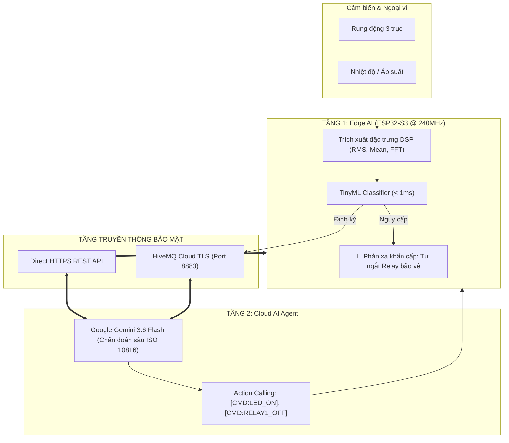

# 🚀 AIoT Library (AIoT_Lib)

<p align="center">
  <b>Framework AIoT & IoT Mã Nguồn Mở Hiệu Năng Cao Cho Các Dòng Vi Điều Khiển ESP32 & Đa Nền Tảng Cloud / AI</b>
</p>

<p align="center">
  
  
  
  
  
  
</p>

---

## 📑 Mục lục (Table of Contents)

1. [Giới thiệu tổng quan (Overview)](#-1-giới-thiệu-tổng-quan-overview)
2. [Kiến trúc hệ thống 5 Phân hệ (Architecture)](#-2-kiến-trúc-hệ-thống-5-phân-hệ-architecture)
3. [Chi tiết các Phân hệ chuyên sâu](#-3-chi-tiết-các-phân-hệ-chuyên-sâu)
   - [3.1. AIoT Core (IoT, MQTT TLS & Web Captive Portal)](#31-aiot-core-iot-mqtt-tls--web-captive-portal)
   - [3.2. AI_Math (Học thuật & Điện toán AI)](#32-ai_math-học-thuật--điện-toán-ai)
   - [3.3. Device (Trừu tượng hóa phần cứng HAL)](#33-device-trừu-tượng-hóa-phần-cứng-hal)
   - [3.4. EdgeAI (Trí tuệ nhân tạo tại biên)](#34-edgeai-trí-tuệ-nhân-tạo-tại-biên)
   - [3.5. CloudAI & HybridAI (Gemini 3.6 Flash & Phối hợp đa tầng)](#35-cloudai--hybridai-gemini-36-flash--phối-hợp-đa-tầng)
4. [Tính năng mới: AI Chat 2 chiều & Điều khiển phần cứng](#-4-tính-năng-mới-ai-chat-2-chiều--điều-khiển-phần-cứng)
5. [Bộ công cụ tự dạy (Huấn luyện) AI (AI Training Suite)](#-5-bộ-công-cụ-tự-dạy-huấn-luyện-ai-ai-training-suite)
   - [5.1. Dạy Edge AI (TinyML) bằng `tools/train_edge_ai.py`](#51-dạy-edge-ai-tinyml-bằng-toolstrain_edge_aipy)
   - [5.2. Dạy Cloud AI (Gemini) bằng `tools/train_cloud_ai.py`](#52-dạy-cloud-ai-gemini-bằng-toolstrain_cloud_aipy)
   - [5.3. Server trung gian `tools/cloud_ai_agent.py`](#53-server-trung-gian-toolscloud_ai_agentpy)
6. [Hỗ trợ phần cứng & Giao thức](#-6-hỗ-trợ-phần-cứng--giao-thức)
7. [Hướng dẫn cài đặt & Bắt đầu nhanh (Quickstart)](#-7-hướng-dẫn-cài-đặt--bắt-đầu-nhanh-quickstart)
8. [Cơ chế Bật / Tắt Debug log sạch sẽ](#-8-cơ-chế-bật--tắt-debug-log-sạch-sẽ)
9. [Các bài ví dụ mẫu (Examples)](#-9-các-bài-ví-dụ-mẫu-examples)
10. [Tác giả & Bản quyền (License)](#-10-tác-giả--bản-quyền-license)

---

## 📖 1. Giới thiệu tổng quan (Overview)

**AIoT_Lib** là một framework mã nguồn mở được thiết kế chuyên biệt cho việc xây dựng các nút mạng **AIoT (Artificial Intelligence of Things)** và hệ thống giám sát công nghiệp thông minh.

Khác với các thư viện IoT truyền thống chỉ truyền nhận dữ liệu thô, **AIoT_Lib** kết hợp chặt chẽ mô hình điện toán **Hybrid AI**:
* **Tầng biên (Edge AI):** Phản xạ bảo vệ thiết bị siêu tốc (**< 1ms**) tại chỗ bằng vi điều khiển ESP32 / ESP32-S3 (ngắt relay, hú còi khi phát hiện rung lắc hoặc nhiệt độ bất thường).
* **Tầng đám mây (Cloud AI):** Kết nối trực tiếp với **Google Gemini 3.6 Flash** qua HTTPS REST hoặc qua MQTT TLS Broker (HiveMQ Cloud) để phân tích xu hướng dài hạn, chẩn đoán sự cố theo chuẩn quốc tế (*ISO 10816-3*) và cho phép người vận hành **trò chuyện tự nhiên và điều khiển phần cứng bằng giọng nói/văn bản**.



---

## 🏛️ 2. Kiến trúc hệ thống 5 Phân hệ (Architecture)

Toàn bộ mã nguồn được thiết kế theo dạng module độc lập (Modular Architecture), tối ưu hóa bộ nhớ RAM và Flash cho vi điều khiển:

```text
AIoT_LIB/
├── src/
│   ├── AIoT.h                         # Header tổng (bao gồm IoT Core & Modbus)
│   ├── AIoT.hpp                       # Khởi tạo instance
│   │
│   ├── AI_Math/                       # 🧮 1. HỌC THUẬT & ĐIỆN TOÁN TOÁN HỌC AI
│   │   ├── AI_Math.h                  # Header chính AI_Math
│   │   ├── Matrix.hpp                 # Ma trận, Vector, Tích vô hướng, Dense Layer
│   │   ├── Statistics.hpp             # Thống kê (Mean, Variance, StdDev, RMS, MinMax, Z-Score)
│   │   ├── DSP.hpp                    # Xử lý tín hiệu (Sliding Window, IIR Filter, FFT)
│   │   ├── Activations.hpp            # Hàm kích hoạt (ReLU, LeakyReLU, Sigmoid, Softmax)
│   │   └── OnlineLearning.hpp         # Tự học trực tuyến trên chip (Welford O(1), Online k-NN, K-Means)
│   │
│   ├── Device/                        # 🔌 2. TRỪU TƯỢNG HÓA PHẦN CỨNG (HAL)
│   │   ├── Device.h                   # Header chính Device (AIoT_Device)
│   │   ├── Device.hpp                 # Quản lý AIoTDeviceManager (LED Onboard, RGB WS2812, Relay)
│   │   ├── Actuator.hpp               # Quản lý Relay, PWM, LED, Buzzer
│   │   ├── Sensor.hpp                 # Cảm biến Analog, Digital, Chip Temp, Free RAM
│   │   └── Profiles/                  # Sơ đồ chân định nghĩa sẵn theo từng bo mạch
│   │       ├── Board_Default_ESP32.h  # ESP32 DevKit Standard
│   │       ├── Board_ESP32_S3_Kit.h   # ESP32-S3 DevKit (RGB WS2812 GPIO 48, Status LED GPIO 2)
│   │       ├── Board_ESP32_CAM.h      # ESP32-CAM AI Vision
│   │       └── Board_AIoT_Industrial.h# AIoT Industrial Controller (RS485 + Opto Relay)
│   │
│   ├── EdgeAI/                        # ⚡ 3. TRÍ TUỆ NHÂN TẠO TẠI BIÊN (TINYML)
│   │   ├── EdgeAI.h                   # Header chính EdgeAI
│   │   ├── EdgeAI.hpp                 # Lớp quản lý suy luận EdgeAI::Engine
│   │   ├── AnomalyDetector.hpp        # Phát hiện bất thường tự căn chỉnh (Auto-baseline Z-Score)
│   │   ├── Classifier.hpp             # Bộ phân loại trạng thái thiết bị đa lớp
│   │   └── Models/                    # Lưu trữ các mô hình mẫu (C-Array Models)
│   │       ├── MotorVibrationModel.h  # Model mẫu phân loại rung động động cơ
│   │       └── CustomModelWeights.h   # Model do script train_edge_ai.py tự động xuất ra
│   │
│   ├── CloudAI/                       # ☁️ 4. CLOUD AI & GENERATIVE AI AGENTS
│   │   ├── CloudAI.h                  # Header chính CloudAI
│   │   ├── PromptTemplates.hpp        # Tự động sinh Prompt JSON chuẩn hóa
│   │   ├── AgentProtocol.hpp          # Chuẩn hóa giao thức giao tiếp 2 chiều với AI Agent
│   │   └── GeminiClient.hpp           # Client gọi trực tiếp HTTPS REST API Gemini 3.6 Flash
│   │
│   ├── HybridAI/                      # 🔄 5. NHẠC TRƯỞNG HYBRID AI (BIÊN + ĐÁM MÂY)
│   │   ├── HybridAI.h                 # Header chính HybridAI
│   │   └── HybridAI.hpp               # Phản xạ tại chỗ + Tích hợp Gemini Client + Đồng bộ Cloud
│   │
│   ├── IoT/                           # 📡 Giao thức AIoT (Protocol, API, Param, Handler)
│   ├── MQTT/                          # 🔐 HiveMQ Cloud TLS 8883
│   ├── WiFi/                          # 🌐 WiFi Manager, Smart Captive Portal WebUI
│   └── Ultility/                      # ⚙️ Modbus RTU/RS485, cJSON, Timer Scheduler
│
├── tools/                             # 🛠️ BỘ CÔNG CỤ DẠY (HUẤN LUYỆN) AI ĐỘC LẬP
│   ├── train_edge_ai.py               # Huấn luyện TinyML & Tự động xuất mã nguồn C++ Header
│   ├── train_cloud_ai.py              # Dạy tri thức nhà máy (ISO 10816) & Action Calling cho Gemini
│   └── cloud_ai_agent.py              # Server Python mẫu làm cầu nối MQTT Broker với Gemini
│
└── examples/                          # 📚 5 BÀI VÍ DỤ MẪU HOÀN CHỈNH
```

---

## 🔍 3. Chi tiết các Phân hệ chuyên sâu

### 3.1. AIoT Core (IoT, MQTT TLS & Web Captive Portal)
- **Chuẩn hóa Topic MQTT**:
  - `device/<MAC_ADDRESS>/telemetry`: Đẩy dữ liệu cảm biến định kỳ lên Cloud.
  - `device/<MAC_ADDRESS>/control`: Nhận lệnh điều khiển từ Web/App/AI Agent.
- **Bảo mật**: Kết nối mã hóa **TLS/SSL (Port 8883)**.
- **Smart Captive Portal (Web PnP)**: Khi mất kết nối hoặc lần đầu khởi động, thiết bị tự động phát Access Point (`AIoT: <MAC>`, IP: `192.168.21.6`) với giao diện Web Responsive để quét WiFi và cấu hình tài khoản MQTT vào bộ nhớ Flash NVS.
- **Lập trình hướng sự kiện**: Macro `Virtual_WRITE(pin)` tự động lắng nghe lệnh điều khiển từ JSON mà không cần viết hàm parse thủ công.

### 3.2. AI_Math (Học thuật & Điện toán AI)
Dành cho lập trình viên và nhà nghiên cứu muốn tự xây dựng hoặc huấn luyện mô hình AI ngay trên chip:
- **`Statistics`**: Tính Mean, Variance, StdDev, RMS, Peak-to-Peak, MinMax, Z-Score.
- **`Matrix`**: Tích vô hướng, khoảng cách Euclid/Manhattan, lớp Dense Layer forward.
- **`DSP`**: Cửa sổ trượt `SlidingWindow`, bộ lọc `MovingAverageFilter`, `LowPassFilter`, và biến đổi Fourier nhanh **`FastFourierTransform` (FFT)** để phân tích phổ tần số rung động / âm thanh.
- **`Activations`**: Hàm kích hoạt mạng nơ-ron (ReLU, LeakyReLU, Sigmoid, Tanh, Softmax, ArgMax).
- **`OnlineLearning`**: 
  - *Thuật toán Welford $O(1)$*: Học phân phối chuẩn trực tuyến liên tục mà không cần lưu mảng dữ liệu trong RAM.
  - *Online k-NN*: Phân loại mẫu trực tiếp trên chip.
  - *Online K-Means*: Phân cụm tự động không cần gán nhãn trước.

### 3.3. Device (Trừu tượng hóa phần cứng HAL)
Cung cấp giao diện `AIoT_Device` độc lập với phần cứng:
- Chọn loại board chỉ bằng 1 dòng cờ: `#define BOARD_ESP32_S3_KIT` hoặc `#define BOARD_AIOT_INDUSTRIAL`.
- Hỗ trợ đèn **LED Onboard thông thường** và **đèn RGB NeoPixel WS2812** (ESP32-S3 GPIO 48).
- Điều khiển ngữ nghĩa: `AIoT_Device.led(true)`, `AIoT_Device.rgb(255, 0, 0)`, `AIoT_Device.relay(1, HIGH)`, `AIoT_Device.beep(100)`.

### 3.4. EdgeAI (Trí tuệ nhân tạo tại biên)
- **Phát hiện bất thường (Anomaly Detection)**: Tự học đường cơ sở (Baseline) trong $N$ chu kỳ khởi động, sau đó tính điểm bất thường Z-Score.
- **Phân loại trạng thái (Classifier)**: Đưa ra cảnh báo `NORMAL`, `WARNING`, `CRITICAL` trong $< 1\text{ms}$.
- **Hỗ trợ nạp mô hình TinyML**: Tương thích mô hình C-Array trích xuất từ `tools/train_edge_ai.py`, Edge Impulse hoặc TensorFlow Lite Micro.

### 3.5. CloudAI & HybridAI (Gemini 3.6 Flash & Phối hợp đa tầng)
- **Tích hợp Gemini 3.6 Flash**: Tự động sinh Prompt JSON chuẩn hóa cho các tác vụ chuẩn đoán lỗi, tối ưu năng lượng và bảo trì dự đoán.
- **Hybrid AI Orchestration**: Phản xạ ngắt relay khẩn cấp tại biên ngay khi có sự cố mà không cần chờ Internet, đồng thời trích xuất đặc trưng gửi lên cho Gemini Agent phân tích xu hướng dài hạn.

---

## 💡 4. Tính năng mới: AI Chat 2 chiều & Điều khiển phần cứng

Hệ thống cho phép bạn trò chuyện trực tiếp với AI thông qua **Serial Monitor** (Baud 115200) và AI có thể **trực tiếp điều khiển các cơ cấu chấp hành trên bo mạch**:

### 🌟 2 Chế độ Chat (Dual-Mode):
1. **Chế độ Trực tiếp HTTPS (Direct HTTPS - Standalone):** 
   ESP32-S3 gọi trực tiếp API của Google Gemini qua HTTPS. Khi bạn gõ câu hỏi vào Serial Monitor, ESP32 sẽ tự hỏi Gemini và nhận câu trả lời sau ~1 giây mà **không cần bất kỳ Server trung gian nào**.
2. **Chế độ Phân tán (Distributed MQTT Agent):**
   ESP32 đẩy câu hỏi lên Broker HiveMQ Cloud, Server backend (`tools/cloud_ai_agent.py`) tiếp nhận, hỏi Gemini và gửi phản hồi về qua topic `device/<MAC>/control`.

### ⚡ Giao thức ra lệnh phần cứng từ AI (Hardware Action Protocol):
Khi bạn trò chuyện với AI, Gemini sẽ nhận diện ý định và tự động phát các mã lệnh điều khiển:
* Người dùng: *"Bật đèn led lên giúp tôi"*
  $\rightarrow$ Gemini: *"Tôi đã bật đèn LED onboard cho bạn rồi nhé! [CMD:LED_ON]"*
  $\rightarrow$ ESP32 tự động bật đèn LED Onboard!
* Người dùng: *"Nhấp nháy đèn led xem nào"*
  $\rightarrow$ Gemini trả lời kèm `[CMD:LED_BLINK]` $\rightarrow$ ESP32 chớp nháy đèn LED liên tục 4 lần.
* Người dùng: *"Tắt đèn led"*
  $\rightarrow$ Gemini trả lời kèm `[CMD:LED_OFF]` $\rightarrow$ ESP32 tắt đèn LED.
* Người dùng: *"Cắt nguồn relay 1 khẩn cấp"*
  $\rightarrow$ Gemini trả lời kèm `[CMD:RELAY1_OFF]` $\rightarrow$ ESP32 ngắt Relay 1 bảo vệ thiết bị.

---

## 🛠️ 5. Bộ công cụ tự dạy (Huấn luyện) AI (AI Training Suite)

Thư mục `tools/` chứa các script hoàn chỉnh giúp nhà nghiên cứu và lập trình viên dễ dàng tự dạy mô hình:

### 5.1. Dạy Edge AI (TinyML) bằng `tools/train_edge_ai.py`
Công cụ giúp bạn đưa dữ liệu cảm biến thực tế vào huấn luyện mô hình phân loại trên chip:
```bash
python tools/train_edge_ai.py
```
* **Tính năng:**
  - Hỗ trợ chạy ngay bằng **Pure Python** (không cần cài thêm thư viện) hoặc tự nâng cấp lên `scikit-learn` & `numpy`.
  - Đánh giá độ chính xác (Accuracy, Confusion Matrix).
  - **Tự động xuất file C++ Header** [`src/EdgeAI/Models/CustomModelWeights.h`](src/EdgeAI/Models/CustomModelWeights.h) chứa ma trận trọng số $W$ và $b$ để nhúng trực tiếp vào ESP32!

### 5.2. Dạy Cloud AI (Gemini) bằng `tools/train_cloud_ai.py`
Công cụ giúp dạy tri thức kỹ thuật chuyên sâu và quy tắc ứng xử cho Cloud AI:
```bash
python tools/train_cloud_ai.py
```
* **Tính năng:**
  - **Zero-Dependency:** Sử dụng thư viện mạng chuẩn của Python (`urllib.request`), không cần `pip install`.
  - **Tự động nhận diện API Key:** Tự động đọc key đã lưu trong `src/main.cpp`.
  - **Nạp tri thức chuyên ngành (Domain Knowledge):** Dạy AI hiểu tiêu chuẩn rung động quốc tế *ISO 10816-3*, ngưỡng nhiệt độ và quy trình khẩn cấp.
  - **Dạy ra lệnh phần cứng:** Dạy AI tự động gắn các thẻ `[CMD:LED_ON]`, `[CMD:RELAY1_OFF]` khi phát hiện nguy cơ cháy nổ, kẹt trục.

### 5.3. Server trung gian `tools/cloud_ai_agent.py`
Script chạy trên máy tính hoặc máy chủ để làm cầu nối giữa HiveMQ Cloud và Gemini:
```bash
pip install paho-mqtt google-generativeai
python tools/cloud_ai_agent.py
```

---

## 💻 6. Hỗ trợ phần cứng & Giao thức

### 🔹 Vi điều khiển (Hardware Support)
- **ESP32** (Dual-Core, Solo-1, WROOM, WROVER)
- **ESP32-S2 / ESP32-S3** (Xtensa LX7 240MHz, hỗ trợ phần cứng mã hóa TLS và lệnh tăng tốc Vector AI)
- **ESP32-C3 / ESP32-C6** (Kiến trúc RISC-V, WiFi 6 & BLE 5)

### 🔹 Giao thức truyền thông
- **WiFi 802.11 b/g/n & Smart Captive Portal WebUI**.
- **MQTT qua TLS/SSL (Port 8883)**.
- **Modbus RTU / RS485** (UART công nghiệp).

---

## 🚀 7. Hướng dẫn cài đặt & Bắt đầu nhanh (Quickstart)

### Cài đặt trong PlatformIO:
Thêm thư viện vào dự án trong file `platformio.ini`:
```ini
[env:esp32-s3]
platform = espressif32
board = esp32-s3-devkitc-1
framework = arduino
monitor_speed = 115200
lib_deps = 
    https://github.com/ThangNguyen2106-dash/AIoT_DEVERLOPMENT.git
```

### Mã nguồn hoàn chỉnh mẫu (`src/main.cpp`):
```cpp
#include <Arduino.h>

// Bỏ comment dòng dưới nếu muốn bật log chi tiết:
// #define DEBUG_COLOR
#define BUTTON_CONFIG

#define BOARD_ESP32_S3_KIT
#include <AIoT.h>
#include <HybridAI/HybridAI.h>

const char *WIFI_SSID = "YOUR_WIFI_NAME";
const char *WIFI_PASS = "YOUR_WIFI_PASSWORD";
const char *MQTT_USER = "IoT_TEST";
const char *MQTT_PASS = "mt21062005";
const char *GEMINI_API_KEY = "YOUR_GEMINI_API_KEY"; // Lấy tại aistudio.google.com

HybridAIEngine hybridAI;

void setup()
{
    Serial.begin(115200);
    AIoT_Device.begin();
    hybridAI.begin(3.0f, 30);
    hybridAI.setGeminiApiKey(GEMINI_API_KEY);
    AIoT.begin(WIFI_SSID, WIFI_PASS, MQTT_USER, MQTT_PASS);
}

void loop()
{
    AIoT.run();
    // Edge AI giám sát liên tục...
    delay(50);
}
```

---

## 🔇 8. Cơ chế Bật / Tắt Debug log sạch sẽ

Hệ thống cho phép bạn kiểm soát hoàn toàn việc xuất log ra Serial:

* **Tắt sạch Debug (Serial Monitor chỉ hiển thị nội dung chat & thông tin bạn in):**
  Chỉ cần comment lại dòng `#define DEBUG_COLOR` ở đầu sketch:
  ```cpp
  // #define DEBUG_COLOR
  ```
  *(Khi tắt, trình biên dịch sẽ tối ưu loại bỏ 100% các chuỗi format log, giúp tiết kiệm gần **13 KB** dung lượng bộ nhớ Flash!)*

* **Bật Debug chi tiết (Xem toàn bộ gói tin WiFi, MQTT, timestamp, Core ID có màu):**
  Bỏ comment dòng `#define DEBUG_COLOR`:
  ```cpp
  #define DEBUG_COLOR
  ```

---

## 📚 9. Các bài ví dụ mẫu (Examples)

Thư viện đi kèm 5 ví dụ mẫu đầy đủ trong thư mục `examples/`:
1. **[`01_Basic_IoT`](examples/01_Basic_IoT/01_Basic_IoT.ino)**: Kết nối WiFi, MQTT TLS 8883, đẩy Telemetry và nhận lệnh qua `Virtual_WRITE`.
2. **[`02_AI_Math_Academic`](examples/02_AI_Math_Academic/02_AI_Math_Academic.ino)**: Minh họa toán học ma trận, hàm kích hoạt, DSP FFT và thuật toán học trực tuyến Welford $O(1)$.
3. **[`03_Edge_AI_Anomaly`](examples/03_Edge_AI_Anomaly/03_Edge_AI_Anomaly.ino)**: Phát hiện bất thường cục bộ không cần Internet và tự động cắt Relay khi vượt ngưỡng an toàn.
4. **[`04_Cloud_AI_Gemini`](examples/04_Cloud_AI_Gemini/04_Cloud_AI_Gemini.ino)**: Đóng gói Prompt công nghiệp và giao tiếp 2 chiều với Google Gemini.
5. **[`05_Hybrid_AI_Industrial`](examples/05_Hybrid_AI_Industrial/05_Hybrid_AI_Industrial.ino)**: Hệ thống phối hợp Hybrid AI hoàn chỉnh giữa ESP32 Edge AI và Gemini Cloud Agent.

---

## 📜 10. Tác giả & Bản quyền (License)

* **Tác giả:** Thang Nguyen ([@ThangNguyen2106-dash](https://github.com/ThangNguyen2106-dash))
* **Bản quyền:** Phát hành theo giấy phép **MIT License**. Bạn có toàn quyền sử dụng, sửa đổi và tích hợp vào các dự án thương mại hoặc nghiên cứu học thuật.